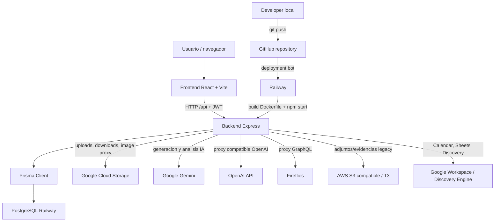

# Brainstudio Intelligence - Architecture

Este documento explica el sistema para un desarrollador que llega hoy al proyecto. Debe mantenerse actualizado cuando cambien rutas, servicios externos, scripts, despliegue o variables criticas.

## Que Es

Brainstudio Intelligence es una aplicacion full-stack para centralizar operaciones de agencia: dashboard, tareas, clientes, reportes, radar de talento, parrillas de contenido, moodboards, minutas, cotizaciones, actividad y finanzas.

El repositorio contiene frontend y backend en una sola base de codigo:

- Frontend: React + Vite + Tailwind.
- Backend: Node.js + Express.
- Base de datos: PostgreSQL via Prisma.
- Produccion: Railway conectado a GitHub.
- Archivos: Google Cloud Storage como storage principal y S3 compatible para algunos flujos.
- IA: Gemini como proveedor principal, con proxies para OpenAI y Fireflies.

## Diagrama



## Carpetas Principales

- `src/components`: componentes React. Incluye `layout`, `modules`, `public` y `ui`.
- `src/components/modules`: pantallas principales de la app: Dashboard, NativeTasks, Clients, Reports, TalentRadar, Activity, FinancialDashboard, Moodboard, Minutes y otros modulos.
- `src/context`: contextos React, especialmente autenticacion y tema.
- `src/lib`: utilidades compartidas del frontend/backend, incluyendo `apiBaseUrl.js`, `prisma.js`, helpers de reportes y credenciales Google.
- `src/routes`: routers Express.
- `src/routes/api`: routers modulares montados bajo `/api`.
- `src/controllers`: controladores Express de alto nivel.
- `src/services`: logica de negocio e integraciones externas.
- `src/middlewares`: middleware Express, incluyendo autenticacion JWT y logging.
- `src/utils`: utilidades de frontend, documentos, audio, PDF y prompts.
- `prisma`: schema de Prisma. La fuente valida es `prisma/schema.prisma`.
- `scripts`: scripts operativos, seeds, migraciones manuales y verificaciones.
- `tests` y `src/tests`: pruebas unitarias, integracion ligera y Playwright.
- `docs`: documentacion tecnica especifica.
- `public`: assets estaticos para Vite.
- `Dockerfile`: build productivo usado por Railway.

## Como Inicia La Aplicacion

### Frontend Local

`npm run dev` inicia Vite en `http://localhost:3000`.

Vite tiene proxy para `/api` hacia `http://localhost:8080`, definido en `vite.config.js`.

### Backend Local

El backend debe correr en `8080` para que el proxy local funcione:

```powershell
$env:PORT="8080"
npm start
```

`npm start` ejecuta:

```bash
npx prisma generate && node server.js
```

### Produccion

Railway construye usando el `Dockerfile`:

1. Instala dependencias con `npm ci --ignore-scripts`.
2. Copia el codigo.
3. Ejecuta `npx prisma generate`.
4. Ejecuta `npm run build`.
5. Arranca con `npm start`.

En produccion, Express sirve:

- API bajo `/api`.
- Frontend compilado desde `dist/`.
- Fallback SPA para rutas no API.

## Backend Express

Entrada principal: `server.js`.

Responsabilidades:

- Cargar `.env` con `dotenv`.
- Configurar CORS.
- Parsear JSON y formularios.
- Registrar requests.
- Montar `/api/gemini`.
- Montar el router principal `/api`.
- Servir `dist`.
- Conectar Prisma a PostgreSQL.
- Inicializar IA.
- Inicializar cron de clasificacion de tareas.

Router principal: `src/routes/index.js`.

## Prisma Y PostgreSQL

Schema principal: `prisma/schema.prisma`.

Reglas importantes:

- El provider debe seguir siendo `postgresql`.
- No usar `schema.sqlite.prisma` como fuente real.
- `DATABASE_URL` es obligatoria para backend y Prisma.
- `Task.completedAt` es parte critica del ciclo de vida de tareas.
- Los cambios de esquema se aplican con cuidado, normalmente mediante `prisma db push` o scripts operativos del proyecto.

Modelos centrales:

- `User`
- `TeamMember`
- `Client`
- `Task`
- `ContentPlan`
- `ContentItem`
- `MetricReport`
- `Board`
- `Quotation`
- `FinancialRecord`

## Variables Criticas

Nunca se deben commitear secretos. `.env` esta ignorado por Git.

Variables backend criticas:

- `DATABASE_URL`: conexion PostgreSQL.
- `JWT_SECRET`: firma/verificacion de tokens.
- `GEMINI_API_KEY`: acceso a Gemini.
- `MODEL_NAME` o `GEMINI_MODEL`: modelo IA.
- `GOOGLE_APPLICATION_CREDENTIALS_JSON`: service account Google en JSON.
- `GOOGLE_CLOUD_PROJECT`: proyecto GCP.
- `GCS_BUCKET_NAME`: bucket GCS, por defecto `brainstudio-unstructured-v2`.
- `SMTP_USER`: correo Google/Gmail o Google Workspace usado para enviar recuperacion de contrasena.
- `SMTP_PASS`: app password o credencial SMTP del correo emisor.
- `SMTP_HOST`: host SMTP, por defecto `smtp.gmail.com`.
- `SMTP_PORT`: puerto SMTP, por defecto `465`.
- `SMTP_FROM`: remitente visible de los correos transaccionales.

Variables externas adicionales:

- `OPENAI_API_KEY`
- `FIREFLIES_API_KEY`
- `AWS_ENDPOINT_URL`
- `AWS_ACCESS_KEY_ID`
- `AWS_SECRET_ACCESS_KEY`
- `AWS_S3_BUCKET_NAME`
- `GOOGLE_CALENDAR_ID`
- `GOOGLE_WORKSPACE_SUBJECT`
- `DISCOVERY_ENGINE_ENGINE_ID`
- `DATA_STORE_ID`
- `ENCRYPTION_KEY`

Variable frontend critica:

- `VITE_API_URL`: URL del backend para builds frontend. En localhost, si no se usa o apunta localmente, `apiBaseUrl.js` cae a `localhost:8080`.

## Dependencias Entre Servicios

- Frontend depende del backend para datos protegidos.
- Backend depende de PostgreSQL para casi todo el estado de aplicacion.
- Backend depende de GCS para archivos, avatares, imagenes de reportes y moodboards.
- Reportes y Brain Core dependen de Gemini.
- Fireflies y OpenAI solo funcionan si sus API keys existen.
- Algunos scripts financieros/evidencias dependen de S3 compatible.
- Google Calendar, Sheets y Discovery Engine dependen del service account de Google.

## Rutas Publicas

Rutas publicas definidas antes del middleware global de autenticacion:

- `GET /api/public/parrilla/:token`
- `POST /api/public/items/:id/approve`
- `POST /api/public/items/:id/comment`
- Rutas publicas de cotizaciones segun `src/routes/api/quotations.js`
- Catalogo de servicios montado en `/api/services`
- `GET /api/reports/pipeline-status`
- `POST /api/login`
- `POST /api/password-reset/request`
- `POST /api/password-reset/confirm`
- `GET /api/sync-users`

Ademas, `authenticateToken` permite bypass para recursos usados en tags de imagen:

- URLs que contienen `/avatar-image`
- URLs que contienen `/image-proxy`
- `/api/clients/:clientId/logo-image`

## Login Y Autenticacion

El login vive en `src/controllers/authController.js`.

Flujo:

1. Frontend envia email y password a `/api/login`.
2. Backend busca usuario en PostgreSQL.
3. Compara password con bcrypt.
4. Firma JWT con `JWT_SECRET`.
5. Frontend guarda token y usuario en `localStorage`.
6. Interceptores globales de `axios` y `fetch` agregan `Authorization: Bearer <token>`.
7. `authenticateToken` valida el JWT en rutas protegidas.

Recuperacion de contrasena:

1. El usuario solicita un codigo desde `/login`.
2. Frontend envia el correo a `POST /api/password-reset/request`.
3. Backend normaliza el correo, busca el usuario y, si existe, genera un codigo de 6 digitos.
4. El codigo se guarda hasheado en `PasswordResetCode`, expira en 10 minutos y permite hasta 5 intentos.
5. El correo se envia por SMTP Google/Gmail configurado con `SMTP_*`.
6. Frontend envia correo, codigo y nueva contrasena a `POST /api/password-reset/confirm`.
7. Backend valida el codigo, actualiza password con bcrypt, marca el codigo como usado e incrementa `sessionVersion` para invalidar sesiones previas.

Los permisos de modulos viven en `modulePermissions`. ADMIN tiene bypass general.

## Uploads

Uploads backend:

- Usan `multer` con `memoryStorage`.
- El archivo llega a memoria como `file.buffer`.
- Luego se sube a GCS o S3 segun el modulo.

Flujos comunes:

- Avatares: `PUT /api/talent-radar/member/:memberId/avatar`.
- Archivos de cliente: `src/routes/api/clientFiles.js`.
- Reportes: `src/routes/api/reports.js`.
- Moodboards: `src/routes/api/boards.js`.
- Adjuntos/evidencias legacy: `src/services/s3Service.js`.

## Google Cloud Storage

Servicio principal: `src/services/storageService.js`.

Funciones principales:

- `uploadClientFile`
- `getUploadSignedUrl`
- `getSignedUrl`
- `deleteFileFromGCS`
- `getClientFileStream`
- `uploadAvatar`

Los objetos se guardan con rutas tipo:

- `avatars/{memberId}_{timestamp}_{filename}`
- carpetas por cliente para archivos y reportes

Los avatares se sirven mediante proxy backend:

```text
/api/talent-radar/member/:memberId/avatar-image?gcsPath=...
```

Advertencia operativa: actualmente el servicio intenta configurar CORS del bucket al cargar el modulo si hay credenciales. Esto puede tocar infraestructura al arrancar local o produccion. Debe tratarse con cuidado y preferiblemente moverse a un script manual explicito.

## Gemini, OpenAI Y Fireflies

Gemini:

- Usado para clasificacion, Brain Core, reportes, insights y analisis.
- Configurado con `GEMINI_API_KEY` y modelo por `MODEL_NAME` o `GEMINI_MODEL`.

OpenAI:

- Proxy compatible en `/api/openai/v1/chat/completions`.
- Usa `OPENAI_API_KEY`.

Fireflies:

- Proxy GraphQL en `/api/fireflies/graphql`.
- Usa `FIREFLIES_API_KEY`.

## Railway

Evidencia del flujo actual:

- GitHub registra deployments creados por `railway-app[bot]`.
- Ambiente: `Brainstudio Lab / production`.
- El deployment activo corresponde a commits en `origin/main`.
- Railway construye el proyecto desde GitHub usando el `Dockerfile`.

Build productivo:

- `npm ci --ignore-scripts`
- `npx prisma generate`
- `npm run build`
- `npm start`

Runtime:

- Railway inyecta variables de entorno.
- Express escucha en `process.env.PORT`.
- El backend sirve API y frontend compilado.

## GitHub

Remote principal:

```text
https://github.com/rchirinosabreu-cloud/intelligence.git
```

Rama principal observada:

```text
main
```

CI:

- `.github/workflows/ci.yml`
- Corre en push y PR hacia `main` o `master`.
- Ejecuta instalacion, Prisma generate, lint, build y algunas pruebas.

## Publicar Una Nueva Version

Flujo recomendado:

1. Crear o usar una rama de trabajo.
2. Hacer cambios locales.
3. Revisar:

```bash
git status
git diff
```

4. Ejecutar pruebas relevantes:

```bash
npm run lint
npm test
npm run build
```

5. Confirmar que no hay secretos:

```bash
git status --short
```

6. Commit:

```bash
git add <archivos>
git commit -m "descripcion clara"
```

7. Push:

```bash
git push origin <rama>
```

8. Abrir PR o mergear a `main`.
9. Railway detecta el commit y despliega.
10. Verificar deployment en GitHub/Railway.

## Verificar Produccion

Formas de verificar:

- Revisar GitHub Deployments del repo.
- Revisar status `Brainstudio Lab - Intelligence`.
- Revisar logs de Railway.
- Revisar endpoints publicos:

```text
/api/reports/pipeline-status
```

Nota: para que `pipeline-status` sea confiable como identificador de commit, produccion debe inyectar un valor real en `REPORT_DEPLOY_COMMIT` o usar `RAILWAY_GIT_COMMIT_SHA` en backend.

## Rollback Seguro

Opcion 1: Railway Dashboard.

1. Abrir proyecto Railway.
2. Ir al servicio de produccion.
3. Abrir Deployments.
4. Elegir un deployment anterior exitoso.
5. Redeploy/Rollback.
6. Verificar health y flujos criticos.

Opcion 2: Git revert.

1. Revertir commit problematico:

```bash
git revert <sha>
```

2. Push/merge a `main`.
3. Railway despliega el revert.

Recomendacion:

- Para incidente urgente: rollback en Railway.
- Para mantener historial sano: hacer despues un revert en Git.

## Checklist Antes De Publicar

- `git diff` solo contiene cambios intencionales.
- No hay `console.log` temporales.
- No hay `.env` ni secretos en `git status`.
- No hay cambios accidentales por formato o line endings.
- Los tests relevantes corren.
- El build pasa.
- El cambio tiene explicacion clara.
- Se sabe como revertirlo.
