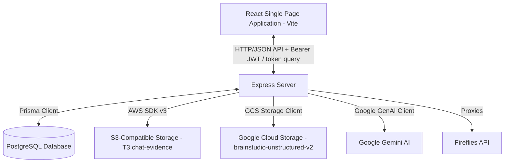
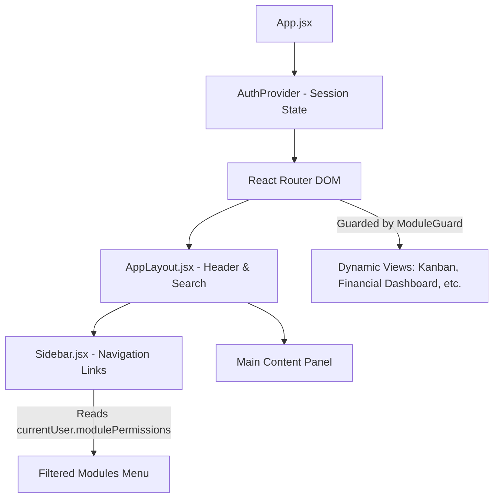
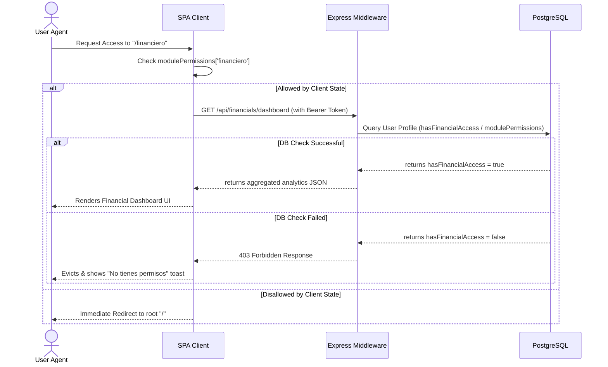
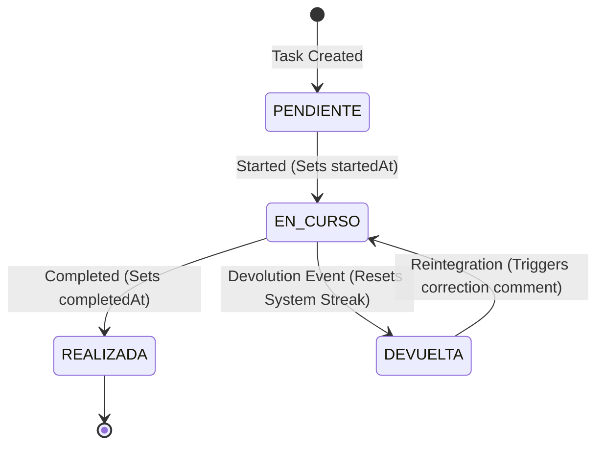
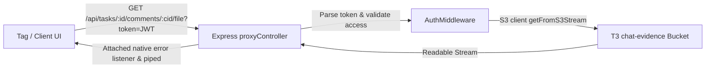

# Brainstudio Architecture & Design Document

This document provides a highly technical, comprehensive, and concise overview of the Brainstudio technical architecture. It serves as a rapid onboarding guide for Senior Software Engineers and AI agents.

---

## 1. Architectural Overview

Brainstudio is a multi-modular enterprise resource planner (ERP) and intelligence platform designed for agency management, task synchronization, creative planning, financial analytical intelligence, and talent merit tracking.

The application uses a decoupled hybrid architecture:
- **Backend**: Express.js server utilizing **Prisma ORM** with a PostgreSQL database, featuring automatic cron triggers, webhook/proxy integrations (S3, GCS, OpenAI, Fireflies), and case-insensitive permission checks.
- **Frontend**: A client-side React SPA powered by **Vite**, styled with **Tailwind CSS**, animated via **Framer Motion**, utilizing **Radix UI** primitives (wrapped as shadcn components), and using **React Query (TanStack Query)** for robust, real-time client-side synchronization and cached state management.



---

## 2. Directory & Folder Structure

```
brainstudio-intelligence/
├── data/                       # Local offline Excel mocks, spreadsheets & tariff sheets (tarifario_2026.csv)
├── docs/                       # Internal documentation and assets
├── prisma/                     # Database schemas and migration configurations
│   ├── migrations/             # Native PostgreSQL schema migration files
│   ├── schema.prisma           # Master PostgreSQL database schema definer
│   └── schema.sqlite.prisma    # SQLite fallback schema for local development/testing
├── public/                     # Static client-side assets (logos, fallback images)
├── scripts/                    # Bootstrap, seeding, database purging, and pre-push enum casting utilities
│   ├── pre-push-enum.js        # Script managing PostgreSQL enum casting & initialization
│   ├── seed_catalog.js         # Service catalog csv ingester
│   ├── seed-team.js            # Extractor & seeding utility from payroll spreadsheet to TeamMember & User tables
│   ├── seed-financials.js      # Relational vertical transposer mapping historical financial record matrices
│   └── hard-cleanup.js         # Dedicated emergency database sanitation tool
├── src/                        # Main Application Codebase
│   ├── components/             # React SPA Component Directory
│   │   ├── layout/             # Universal Layout Containers (AppLayout, Sidebar, ChaosMeter)
│   │   ├── modules/            # Domain-Specific Module Views
│   │   │   ├── Activity/       # OperationalCalendar & MemberActivityCard
│   │   │   ├── Clients/        # ClientExpandedDetail, ClientDetail, and HealthCheckWidgets
│   │   │   ├── ContentGrids/   # Creative Content Planning Calendars & Modal controls
│   │   │   ├── Minutes/        # Transcripts, multi-file audio processors & fireflies widgets
│   │   │   ├── Moodboard/      # Infinite-canvas brand boards & visual layouts
│   │   │   ├── Quotations/     # CatalogManagement, QuotationForms & sequential item tables
│   │   │   ├── Radar/          # TalentRadar, performance matrices & AvatarUploader
│   │   │   ├── ...             # Kanban board (NativeTasks.jsx) & TaskSidePanel.jsx Centered Modal
│   │   └── ui/                 # Reusable Radix Primitives & styled components (Dialog, SlideOver)
│   ├── config/                 # Dynamic AI system models, temperatures, and configurations
│   ├── context/                # Context Providers (ThemeContext, AuthContext)
│   ├── controllers/            # Express Endpoint Handler Controllers (MVC Logic Split)
│   ├── lib/                    # Low-level service initializers (prisma.js client wrapper, apiBaseUrl)
│   ├── middlewares/            # Request Interceptors (authenticateToken, requireModulePermission)
│   ├── routes/                 # Express API Endpoint Route Declarations (api/ subfolders)
│   ├── services/               # Core Relational Business Services
│   └── utils/                  # Domain-independent helpers (pdfExport, chartVisualizations, linkifiers)
├── server.js                   # Node.js production web server entry-point
└── vite.config.js              # Vite application bundler configuration
```

---

## 3. Database Schema (Prisma Models)

The core relational database schema is modeled via Prisma (`prisma/schema.prisma`). To ensure query high performance under extensive historical aggregations, indexes are programmatically defined on highly-queried operational and financial fields.

### Key Database Enums
- `SystemRole`: `ADMIN`, `PROJECT_MANAGER`, `EDITOR`, `VIEWER`. Controls master roles.
- `ClientStatus`: `PROPUESTA_ENVIADA`, `CONTRATO_PENDIENTE`, `RECOPILANDO_ACCESOS`, `ACTIVO`, `ALERTA_RENOVACION`, `CERRADO`.
- `TaskStatus`: `PENDIENTE` (Pendiente), `EN_CURSO` (En proceso), `REALIZADA` (Realizado), `DEVUELTA` (Devuelto).
- `AttachmentCategory`: `REFERENCIA` (Reference URLs), `INSUMO` (Production Inputs).
- `FinancialCategory`: `MEMBRESIA`, `PAUTA`, `NOMINA`, `LOGISTICA`, `ADMINISTRATIVO`, `TAX`, `FINANCIAL`, `OPERATIVO`.
- `FinancialType`: `INCOME` (Positive inflow), `EXPENSE` (Negative outflow).
- `AdjustmentType`: `BONUS` (+), `COMMISSION` (+), `DEDUCTION` (-), `NOVELTY` (Adds if positive, subtracts if negative).
- `ReceivableStatus`: `DEBE` (Outstanding), `PAGADO` (Settled), `PROMESADO` (Deferred agreement).
- `ServiceCategory`: `BRANDING`, `DISENO`, `PRODUCCION_AUDIOVISUAL`, `MARKETING`, `ADS`, `EDITORIAL`, `WEB`, `DESARROLLO`.

### Critical Business Models & High-Level Relationships

#### User & TeamMember (Identity Duality)
User-profiles represent credentials and system module permissions, while `TeamMember` represents physical actors within client assignments and tasks. They are linked via a `userId` unique foreign key.
- `User`: Has email (unique), password, `SystemRole`, and `modulePermissions` (a JSONB matrix), and is linked to `TeamMember` (optional, 1:1 relationship).
- `TeamMember`: Linked to `User`, acts as the assigned target for `Task` (`assigneeId`) and owner of `ContentPlan` (`ownerId`). Holds optional desktop positioning variables (`desktopX`, `desktopY`) for agency dashboard visualization.

#### Client & ClientHealth
- `Client`: Houses client definitions, monthly fees (stored as absolute `Decimal`), S3/GCS media buckets, page integrations, and assigned responsible project managers (`responsibleId` linked to `TeamMember`).
- `ClientHealth`: A performance record evaluated on a monthly basis, strictly unique per `[clientId, month, year]`. Tracks content status, report status, and overall health scores (`score`).

#### Task, TaskAttachment, TaskComment, and TaskFollower
- `Task`: Holds operational tasks. Links to `Client`, `TeamMember` (assignee), `User` (creator), and `ContentItem` (optional, for content item production tracking).
- `TaskAttachment`: Maps files associated with a task, categorized under `AttachmentCategory` (`REFERENCIA` or `INSUMO`). Cascade-deletes with the parent task.
- `TaskComment`: Stores conversations, system logs, and feedback loops. Differentiates normal comments from system transitions using a `type` string (`human`, `system_return`, `system_reintegrate`).
- `TaskFollower`: A unique join-model enabling multiple users to follow a specific task's lifecycle transitions and receive reactive notifications.

#### Financial Record & Payroll Structure
- `FinancialRecord`: Maps actual cash inflows/outflows. Links to `Client` and `User` (optional). Features indexes on `date`, `category`, and `type`.
- `PayrollContract`: Stores the employee baseline: base salary (`baseSalary` as `Decimal`), social security (`socialSecurity` as a fixed absolute value), and date ranges.
- `PayrollTransaction`: Stores monthly computed salaries, uniquely scoped per `[userId, month, year]`. Has many `PayrollAdjustment` adjustments.
- `PayrollAdjustment`: Represents additions or subtractions (`BONUS`, `COMMISSION`, `DEDUCTION`, `NOVELTY`) applied to a specific transaction.

#### AccountsReceivable (Aged Debts)
- `AccountsReceivable`: Tracks outstanding receivables ("cartera morosa"). Indexes exist on `clientId`, `period`, and `status`. Only records under `status: 'DEBE'` are aggregated as outstanding liability.

---

## 4. API Endpoints Map

### Public Routes `/api` (No Authentication)
- `GET /public/parrilla/:token` : Serves public content plan view for client reviews.
- `POST /public/items/:id/approve` : Direct approval action of content grid elements.
- `POST /public/items/:id/comment` : Logs review comments on specific elements.
- `USE /quotations` : Serves public PDF exports and consecutive lookups.

### System Authentication
- `POST /api/login` : Authenticates credentials, signs JWT, and hydrates client-side permissions including `hasFinancialAccess` and `modulePermissions`.
- `GET /api/auth/me` : Returns the authenticated user's profile and serialized module permissions.

### Task Management Operations
- `GET /api/tasks` : Fetches tasks, optionally filtered by `clientId`.
- `POST /api/tasks` : Creates tasks atomically (under a single transaction wrapping references, inputs, and initial comments).
- `POST /api/tasks/reorder` : Persists drag-and-drop order within columns (transaction-based updating of `sortOrder`).
- `PATCH /api/tasks/:taskId` : Modifies task properties inline (assignee, due date, status, priority, or soft attachments).
- `DELETE /api/tasks/:taskId` : Logs deletion reasons to `DeletedTaskLog` and hard-deletes the task record.
- `POST /api/tasks/:taskId/comments` : Handles task chat messages, parsing text for user mentions, and uploading media.

### Financial Analytics
- `GET /api/financials/dashboard` : Aggregates cash flows, aged debts, categories, and consolidated payroll. Requires the explicit `hasFinancialAccess` flag validation on the querying user.

### Talent Radar & AI Appraisals
- `GET /api/talent-radar/summary` : Computes performance metrics, active work status, and Nine-Box positioning.
- `POST /api/talent-radar/member/:memberId/ai-insights` : Calls Gemini AI to analyze individual task complexities, error rates, and qualitative return feedback.

---

## 5. UI Component & Layout Architecture

The user interface follows a responsive grid system with persistent layout containers, conditional permission blocks, and strict Radix dialog structures.



### Layout Core Elements
- `AppLayout.jsx`: Houses the main grid wrapper, search bar, active user indicators, notifications drawer, and dark-theme switchers.
- `Sidebar.jsx`: Filters navigation links dynamically based on the current user's profile permissions.
- `ChaosMeter.jsx`: Inside the sidebar. Queries the active system streak and displays the current "Atención Requerida" badge powered by React Query.

### Crucial Security Components
- `ModuleGuard`: Intercepts client-side navigation. It bypasses security for `ADMIN` users and verifies `modulePermissions[moduleName] === true` for non-admin users.

### Main View Layouts
- **Kanban Board (`NativeTasks.jsx`)**: Displays columns mapped to `TaskStatus` enums. Restricts column reordering for non-PM users and invalidates sidebar queries dynamically to ensure UI reactivity.
- **Task Focus Modal (`TaskSidePanel.jsx`)**: Implements a centered, immersive symmetrical split-column dialog (`Dialog.jsx`). The left column houses inline edition selectors and categorized links; the right column maintains a spacious chronological message feed with automatic scrolling to the newest message.

---

## 6. Special Technical Workflows

### Dynamic RBAC & Module Permissions

Authentication uses a dual-check validation pattern:
1. **Frontend Filtering**: Navigation links and module accessibility are filtered based on `modulePermissions` JSON parsed keys.
2. **Backend Interception**: A case-insensitive middleware checks permissions:



### Task Lifecycle, Transitions, and Mirror Effect

Operational tasks go through a strict state machine managed by `nativeTaskService.js`.



- **Devolution Event**: When a task moves to `DEVUELTA`, `returnCount` increments, and a decoupled transaction creates a `system_return` comment using `returnReason`. The `SystemStreak` is immediately reset to 0.
- **Reintegration Event**: Returning a task back to `PENDIENTE` or `EN_CURSO` triggers a `system_reintegrate` comment containing `reintegrateReason`. This sends a notification to the responsible party or author.
- **Mirror Effect**: When a task linked to a `ContentItem` changes state, it updates the associated item status (e.g., `REALIZADA` maps the `ContentItem` to `REALIZADO` or `PUBLICADO`; `DEVUELTA` maps it to `DEVUELTO`).
- **Drag-and-Drop Column Reordering**: Only users with roles of `ADMIN`, `PROJECT_MANAGER`, or `PM` can alter task priority `sortOrder` values inside the same status column. Dragging cards across columns is permitted for all users.

### File Storage Persistence & Proxy Architecture

To maintain access controls and prevent cross-origin errors, static assets are served through Express proxy routes:



1. **S3 Storage (chat-evidence)**: High-speed storage for chat evidence and task chat media. Implemented in `s3Service.js` using `@aws-sdk/client-s3`.
2. **Google Cloud Storage (GCS)**: Used for structured files, client brand assets, deliverables, and team member avatars under `avatars/` paths.
3. **Download Proxy (`/download`)**: Promotes browser downloads by dynamically setting `Content-Disposition: attachment; filename="..."`, bypassing CORS blocks.
4. **Resilience**: The backend proxy controllers attach native error listeners to the S3/GCS `ReadableStream` prior to piping it to the Express response stream, preventing unhandled stream rejections and SIGTERM signals.

### Financial Aggregation & Nine-Box Matrix Calculations

#### Cash Flow Calculation
The analytical dashboard combines transactions dynamically applying decimal-aligned arithmetic:
$$\text{Net Flow} = \sum (\text{FinancialRecord}_{\text{INCOME}}) - \sum (\text{FinancialRecord}_{\text{EXPENSE}})$$

#### Dynamic Payroll Consolidation
For each employee, the net salary calculations combine base contract salaries, social security, and algebraic transaction adjustments:
$$\text{Total Paid} = \text{Base Salary} + \text{Social Security} + \sum (\text{Adjustments})$$
- Where `BONUS`, `COMMISSION` are additions, `DEDUCTION` is a subtraction, and `NOVELTY` represents an algebraic value (positive adds, negative subtracts).

#### Nine-Box Talent Radar Matrix
Positions team members on a $3 \times 3$ grid evaluating quality against complexity over a specific month:
- **Complexity (X-Axis)**: Calculated as the average complexity of completed tasks. Maps text values: `BAJA = 1.0`, `MEDIA = 2.0`, `ALTA = 3.0`.
- **Quality (Y-Axis)**: Measured by the average devolution count (`returnCount`) on completed tasks. Lower counts indicate higher output quality.
- **Gemini AI Insights**: Prompts Google Gemini with qualitative return comments and task complexity weights to generate high-level summaries for monthly 1-on-1 performance review sessions.

---

*Document generated dynamically. Brainstudio technical design standard v2026.1.*
