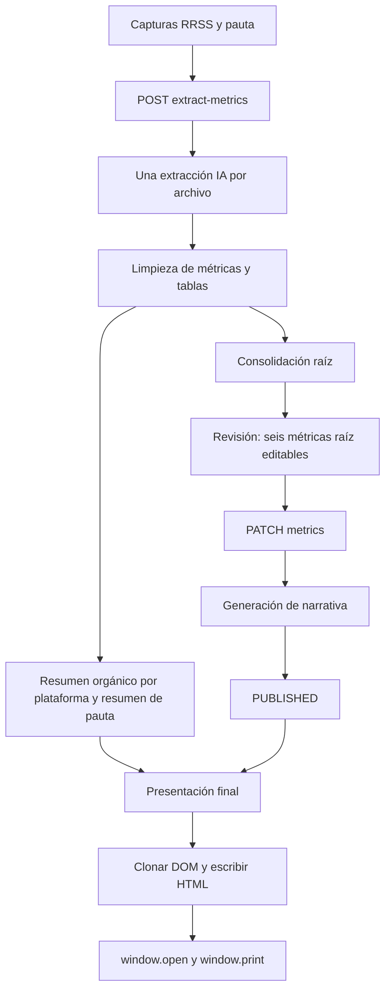

# Auditoría del módulo Reportes

**Fecha:** 15 de septiembre de 2026. **Código:** `9a06040c06d0ee3e6c8709d8e7425c345b6f4cdf`.

**Seguimiento:** este documento conserva el diagnóstico anterior a los cambios. La [implementación local y sus verificaciones](REPORTS_IMPLEMENTATION_2026-09-15.md) describe el estado posterior; no equivale a un despliegue productivo. La evaluación identificable de capturas reales permanece local.

## Dictamen ejecutivo

El módulo presenta defectos verificables en la identidad, consolidación, revisión y presentación de las cifras. El botón «Descargar PDF» abre una ventana de impresión: no genera ni descarga un archivo PDF. Corregir únicamente la exportación dejaría intactos los errores de datos.

La recomendación es mantener la ingesta por capturas, introducir un registro verificable de cada observación y producir pantalla, narrativa y PDF desde una misma versión aprobada. Un modelo de IA diferente, un prompt más largo o una plantilla más vistosa no resuelven por sí solos estos defectos.

**Hallazgos agrupados: 20 — 1 P0, 14 P1 y 5 P2.** P0 bloquea la entrega esperada; P1 compromete datos, aprobación, persistencia o seguridad; P2 afecta operación, diagnóstico o calidad de uso. No se incluyen observaciones cosméticas menores como hallazgos independientes.

### Ejemplos reproducidos

Todos los siguientes datos son **sintéticos**, procesados por funciones o componentes reales sin modificar su implementación.

| Entrada o acción | Resultado actual | Consecuencia |
|---|---|---|
| Alcance orgánico de Instagram: 7.000 | `reachOrganic=7000`, pero `reach=null` pasa a cero y el resumen omite el alcance | Se pierde una cifra disponible |
| 10.000 visualizaciones con `scope=MIXED` | Se elimina `scope` y entran como orgánicas | Pauta y orgánico se confunden |
| Campaña: 1.000; conjunto incluido: 600 | Gasto consolidado: 1.600 | Doble conteo |
| Dos anuncios con cifras iguales salvo clics | Consolidación raíz: gasto 200 / CTR 2%; resumen de pauta: gasto 100 / CTR 1% | Dos cifras para un mismo informe |
| Interacciones: 43; clics: 7 | Tabla: «Impresiones 43», «Alcance 7» | Cambia el significado de los datos |
| Ranking con un único `value=12` | Resultados 12, impresiones 12, alcance 12 | Se rellenan columnas sin evidencia |
| Corregir inversión 100 → 250 | Valor revisado 250; `adsSummary` permanece en 100 | La revisión no corrige el informe final |
| Texto con ventas inventadas y Facebook en una sección de Instagram | Validador: `valid=true` | El formato se confunde con veracidad |
| Editar cifras mientras se genera la narrativa | Se publica una narrativa de 100 con la cifra vigente en 250 | Publicación de una versión obsoleta |
| Porcentaje `1.999%` al exportar | `1.00%` | La exportación altera la cifra |

Captura local de auditoría: Tablas reales del módulo con datos sintéticos que evidencian el intercambio de métricas.

## 1. Alcance, método y límites

Se revisaron el componente activo `Reports.jsx`, los servicios de visión y extracción, los dos consolidadores, validadores de narrativa, rutas, modelos Prisma, exportador HTML/impresión, servicio PDF reutilizable y pruebas existentes. Se siguieron `AGENTS.md`, la skill `audit` y la verificación antes de concluir. Las dependencias de diseño `frontend-design`/`teach-impeccable` no están instaladas; se utilizaron las reglas visuales explícitas del proyecto.

Se ejecutaron pruebas locales, funciones con entradas sintéticas, un handler real con persistencia simulada y componentes reales en Chrome con datos controlados. Las capturas no son reportes de clientes ni certifican exactitud de OCR en producción. El escenario de concurrencia usa persistencia simulada: demuestra la ausencia de protección en el handler, no constituye una prueba concurrente contra PostgreSQL.

No se inspeccionaron capturas reales de un cliente, logs de su intento fallido, estado del despliegue ni contenido de la base productiva. Por ello no se afirma cuál de los defectos explica cada cifra histórica ni si el navegador del usuario bloqueó el popup. **No se modificó implementación, esquema, datos ni configuración productiva.**

### Recorrido activo comprobado



Existe otro flujo `/generate` con `reportExtractionService.js` y `StructuredReportSection.jsx`, pero el botón actual utiliza `/extract-metrics`. También existe `pdfRenderer.js`, usado por Minutas mediante `/report-pdf/render`; **Reportes no lo llama**. El permiso `minutas` de esa ruta no es la causa actual del fallo de Reportes, aunque habría que resolver la autorización al reutilizar ese motor.

## 2. Hallazgos P0 y P1

### R01 · P0 — El botón PDF no cumple la descarga prometida

**Ubicación:** `src/components/modules/Reports.jsx:1439`, `:1475`, `:1519`.

El handler escribe HTML en un popup y ejecuta `window.print()` a los 350 ms. No hay respuesta `application/pdf`, bytes PDF ni descarga de archivo. Si el popup se bloquea, falla; si no se bloquea, el usuario todavía debe guardar desde el diálogo. El mensaje exacto es «PDF listo para guardar desde el diálogo de impresión»: solo acredita que se abrió la ventana, no la generación del archivo. En DRAFT el botón está visible pero `reportRef` no existe y el handler retorna sin acción.

**Solución:** endpoint de exportación de Reportes por `reportId` y versión aprobada, con permiso `reportes`, renderer del servidor, descarga binaria y nombre estable. Reutilizar el motor existente tras revisar su contrato; no acoplar los permisos de Reportes a Minutas. Esperar recursos y confirmar generación antes del mensaje de éxito. **Aceptación:** clic → archivo `%PDF-` legible, sin diálogo de impresión, para usuario con Reportes y sin Minutas.

### R02 · P1 — Se pierde la procedencia de plataforma y el alcance orgánico/pagado/mixto

**Ubicación:** `Reports.jsx:1174`; `reportVisionService.js:85`, `:351`, `:568`, `:592`; `reportStructure.js:98`.

El frontend envía las capturas de RRSS y pauta con el mismo campo `files`; la elección del operador desaparece. La extracción pide `metric.scope`, pero el limpiador no lo conserva. La clasificación posterior depende de `sectionCategory`, no del alcance de cada cifra: se reprodujo una métrica MIXED contabilizada como orgánica. La inferencia también usa nombre de archivo cuando no hay plataforma explícita. El JSON sí guarda algunas plataformas; el problema no es una ausencia total de desglose, sino una cadena que no garantiza su identidad.

La demografía global conserva el último grupo no vacío (`reportVisionService.js:736`): puede combinar edades de Instagram con ciudades de Facebook. La ruta crea una sección por tener demografía, pero no copia `demographics` en ella (`reports.js:352`); el frontend espera ese campo y puede omitir la sección. Los contenidos destacados se concatenan sin fuente/plataforma (`reportVisionService.js:750`) y el bloque común se muestra como «Desempeño de anuncios» (`Reports.jsx:1860`), incluso si incluye contenido orgánico.

**Solución:** separar ejes: plataforma (`INSTAGRAM`, `FACEBOOK`, `META_COMBINED`, desconocida), superficie de origen y distribución (`ORGANIC`, `PAID`, `MIXED`, desconocida). Preservar selección humana y detección como hechos distintos. Si se contradicen, resolver antes de aprobar. Una captura de Instagram no es necesariamente 100% orgánica; una campaña de Meta no se puede repartir entre Instagram y Facebook sin desglose visible. **Aceptación:** MIXED nunca entra a orgánico; nombres de archivo no sobreescriben evidencia visual confirmada.

### R03 · P1 — Cero y dato ausente cambian de significado

**Ubicación:** `reportVisionService.js:590`; `reportStructure.js:7`, `:30`; `reportPresentation.js:14`, `:33`, `:67`; `reportChartData.js:1`, `:26`.

La limpieza convierte ceros observados en `null`; después `Number(null)` crea ceros. El alias de alcance orgánico queda oculto por un objeto `reach` con valor cero. Los filtros eliminan métricas, filas y frases con cero. En el formulario, introducir cero hace desaparecer el campo, impidiendo corregirlo de nuevo. Una curva pierde puntos de cero y puede sugerir continuidad inexistente.

**Solución:** conservar valor y estado por separado: observado, no visible, ilegible, no aplicable y conflicto. Cero observado debe seguir siendo cero. Si no hay dato, mostrar «No disponible» con motivo, sin rellenarlo ni narrarlo como cero. **Aceptación:** cero sobrevive desde captura hasta PDF y mantiene el campo editable; ausencia nunca se transforma en cero.

### R04 · P1 — Normalización numérica sin contexto suficiente

**Ubicación:** `reportVisionService.js:11`; `reportChartData.js:3`.

Reproducciones: `20.1K → 20.1`, `1,2 M → 1.2`, `0.123% → 123` y signo menos Unicode `−42,9% → +42.9`. Se aceptan cadenas mal formadas como `1.2.3`. El caso de miles frente a tres decimales es ambiguo sin unidad/idioma. La extracción pide números a la IA, por lo que estas pruebas evidencian la fragilidad del normalizador, no prueban que cada salida real llegue como string.

**Solución:** un solo parser por tipo/unidad/idioma, sufijos explícitos, signo normalizado y conservación del texto original. Rechazar ambigüedades, negativos imposibles y valores no finitos. Calcular con precisión definida y redondear solo al presentar. **Aceptación:** corpus con formatos españoles/ingleses, K/M/mil/millones, porcentajes, monedas y signos; salida correcta o conflicto explícito.

### R05 · P1 — Los consolidadores pueden sumar duplicados o descartar entidades distintas

**Ubicación:** `reportVisionService.js:699`, `:731`, `:761`; `reportStructure.js:15`, `:64`.

Se deduplica por coincidencia de cifras, sin identidad de cuenta/campaña/anuncio ni jerarquía. Los dos consolidadores emplean firmas diferentes. Se reprodujo campaña + conjunto incluido = 1.600 en lugar de 1.000, y raíz 200/2% frente a resumen 100/1%. Además, usar el máximo alcance observado como «Alcance Total» no demuestra la unión de las audiencias. No se comprueba compatibilidad de moneda, tipo de resultado, ventana de atribución o denominador del CTR antes de sumar/calcular.

El resumen orgánico combinado suma cifras, pero hereda la variación y `sourceId` de la primera fuente: Facebook 100 (+10%) e Instagram 100 (−50%) producen 200 con +10% y fuente solo Facebook. El valor combinado y sus metadatos no representan el mismo conjunto de evidencia.

**Solución:** un único consolidador con reglas por métrica y alcance. Elegir el total autorizado de la fuente; sumar solo entidades disjuntas verificadas. Igualdad de cifras no significa duplicado. Mantener jerarquía campaña/conjunto/anuncio. Alcance único se conserva desde un total de fuente compatible; si no existe, declarar que no es consolidable. Resultados se separan por tipo; CTR se calcula con el tipo correcto de clic e impresiones del mismo conjunto. **Aceptación:** duplicar/reordenar capturas no cambia el reporte; añadir un detalle ya incluido no aumenta el total.

### R06 · P1 — El período seleccionado no se concilia con el período y cuenta de las capturas

**Ubicación:** `reports.js:243`, `:430`; `reportStructure.js:20`, `:33`; `reportVisionService.js:930`.

La ruta guarda las fechas elegidas, pero no excluye ni bloquea métricas de otras fechas. En resúmenes orgánicos de igual prioridad gana la primera fuente: invertir capturas de julio/agosto cambió 100 por 200. El prompt narrativo impone el período del formulario sin resolver esa discrepancia. Tampoco hay un contrato de identidad de cuenta visible que la concilie con el cliente seleccionado. Fechas inválidas/invertidas se validan en UI, sin una validación equivalente antes de procesar en backend.

**Solución:** verificar cuenta, fechas, zona horaria y filtros por fuente antes de consolidar. Distinguir período actual, comparación y acumulado histórico. Bloquear conflicto, permitir exclusión explícita con motivo y solicitar recaptura cuando falten encabezados. **Aceptación:** una captura fuera de período no termina rotulada con el mes elegido; una cuenta distinta no se acepta silenciosamente.

### R07 · P1 — Las tablas sustituyen unas métricas por otras

**Ubicación:** `reportVisionService.js:568`; `reportChartData.js:26`; `Reports.jsx:372`, `:442`.

El limpiador adapta el dataset sin pasar `chartType`, perdiendo columnas independientes. Luego el ranking usa `item.value` para llenar resultados, impresiones y alcance. `TopContentTable` usa visualizaciones como resultados, interacciones como impresiones y clics como alcance. El navegador confirmó 12/12/12 a partir de una sola cifra y 43 interacciones rotuladas como impresiones.

**Solución:** columnas con identificador, unidad y definición estables; ningún fallback entre conceptos. Conservar datasets de tabla sin pasarlos por un adaptador de curva. Tablas distintas según las métricas realmente disponibles en orgánico y pauta. **Aceptación:** celdas ausentes muestran ausencia y una cifra nunca aparece en una columna de otra métrica.

### R08 · P1 — Aprobar y corregir cifras no actualiza todos los consumidores

**Ubicación:** `Reports.jsx:900`, `:1214`, `:1834`; `reports.js:535`; `reportVisionService.js:836`.

Solo seis métricas raíz de pauta son editables. La revisión orgánica se muestra en lectura. El PATCH conserva `adsSummary`, `sourceExtractions` y resúmenes previos sin recalcularlos. Se reprodujo edición 100 → 250 con resumen final aún en 100; la narrativa recibe ambos valores.

**Solución:** revisar observaciones por fuente, plataforma y período, incluyendo orgánico, ceros y tablas. Persistir la corrección con autor/motivo, invalidar cálculos dependientes y derivar de nuevo todos los resúmenes. Validar tipo, unidad, rango y versión en servidor. **Aceptación:** editar una observación cambia de forma coherente revisión, gráfica, tabla, narrativa y PDF.

### R09 · P1 — Moneda y tipo de seguidores se rotulan sin respetar su significado

**Ubicación:** `reportVisionService.js:594`; `Reports.jsx:578`, `:588`, `:673`.

La limpieza fuerza `spend` a COP; el render siempre imprime COP aunque la unidad recibida sea USD. `follows` se muestra siempre como «Nuevos seguidores», incluso si la fuente representa la audiencia total. El harness mostró USD 100 como COP 100 y seguidores totales 7.038 como nuevos. En gráficos, el adaptador descarta `percentage` si hay `value`; el renderer DONUT añade `%` al valor restante. Un punto `{value:400, percentage:40}` queda como 400 y se rotula 400%, por falta de unidad y denominador explícitos (`reportChartData.js:26`, `Reports.jsx:342`).

**Solución:** conservar moneda explícita sin conversión implícita. Separar seguidores al cierre, nuevos, bajas y crecimiento neto. Preservar tipo de porcentaje y base de cálculo; una distribución no equivale a una variación. **Aceptación:** no sumar monedas distintas ni llamar crecimiento al stock total; cambio de moneda requiere conversión explícita y documentada.

### R10 · P1 — Confianza y completitud exageradas; evidencia parcial insuficiente

**Ubicación:** `reportVisionService.js:597`, `:617`, `:646`, `:786`; `reports.js:295`, `:343`, `:396`.

Una frase narrativa de más de diez caracteres basta para declarar utilizable una captura sin métricas. La confianza global se pierde al limpiar y se guarda como 1.0; los agregados también reciben 1.0. La UI presenta 100% con confianza cero por usar `|| 1.0`. Fuentes parciales/fallidas contribuyen al contador y advertencias, pero solo las exitosas se crean como registros de fuente. No hay bloqueo de publicación por cobertura incompleta.

**Solución:** manifest persistente de todos los archivos y su estado; reintento individual e idempotente; confianza original sin sustituirla por certeza. Separar legibilidad de OCR, validación semántica, consistencia matemática y aprobación humana. Las métricas publicadas deben conservar referencias a todas sus evidencias. **Aceptación:** una extracción solo narrativa no acredita cobertura; fallar una captura necesaria impide publicar o exige exclusión explícita visible.

### R11 · P1 — La validación de narrativa comprueba estilo, no sustento factual

**Ubicación:** `reportVisionService.js:867`, `:885`, `:1534`.

El validador exige dos párrafos, nombre del cliente y cantidad de menciones numéricas; no coteja cifras, plataformas, unidades, causalidad ni evidencia. Una narrativa sobre 999999 ventas y 888888 clientes nuevos pasó con fuente Instagram de 100 vistas y 10 interacciones. También pasó un `sectionId` inexistente, que al reconciliar deja un comentario vacío. Sin secciones se declara publicable un titular sin respaldo. No hay validación equivalente de todas las afirmaciones del resumen ejecutivo.

**Solución:** narrativa construida sobre hechos aprobados identificables; exigir referencias por afirmación cuantitativa, IDs exactos sin repetición ni omisiones y validación de plataforma/período/unidad. Tratar recomendaciones como hipótesis, sin declarar ventas/ROI ni causalidad a partir de actividad social. Eliminar la obligación artificial de dos cifras o dos párrafos cuando no hay evidencia suficiente. **Aceptación:** cifra, fuente, red o ID inexistente bloquean publicación; JSON dentro de bloques markdown sigue cubierto por pruebas.

### R12 · P1 — Publicación sin protección de versión ni aprobación final independiente

**Ubicación:** `reports.js:515`, `:591`, `:596`, `:651`, `:654`; `schema.prisma:1763`.

La generación lee y, varios minutos después, escribe por ID sin comparar versión o huella. Se reprodujo una edición intermedia a 250 seguida de publicación de narrativa con 100. Una generación formalmente válida cambia automáticamente a `PUBLISHED`, sin comprobar cobertura ni revisión final del documento. El PATCH tampoco restringe de forma suficiente las transiciones de un informe publicado.

**Solución:** versión/huella de observaciones, criterios de agregación y documento; comparación atómica antes de guardar o publicar. Generación termina en «Listo para revisión»; aprobación humana explícita crea snapshot inmutable con actor/fecha. Editar después crea nueva versión e invalida narrativa y exportación anteriores. **Aceptación:** resultado tardío sobre datos cambiados se descarta y nunca recibe estado publicado.

### R13 · P1 — Se puede exportar un informe con narrativa fallida ocultando su advertencia

**Ubicación:** `Reports.jsx:1291`, `:1475`, `:1519`, `:1665`, `:1705`.

Los botones dependen de que exista `report`; los estados distintos de DRAFT, incluido REVIEW, renderizan el canvas. La advertencia `NARRATIVE_FAILED` usa `no-print` y el exportador la elimina. El handler no verifica publicabilidad, fuentes o versión. Se comprobó que el HTML exportado pierde la advertencia.

**Solución:** bloquear exportación final en servidor y UI salvo snapshot aprobado vigente. Permitir borrador solo como acción separada, marcado de forma permanente en todas sus páginas. **Aceptación:** un informe incompleto no se entrega con portada de «Reporte oficial» ni pierde su condición de borrador.

### R14 · P1 — Exportar modifica porcentajes por un redondeo defectuoso

**Ubicación:** `Reports.jsx:1443`.

Una regex sobre todo el HTML redondea únicamente la parte decimal, sin llevar el acarreo al entero: `1.999% → 1.00%`, `0.999% → 0.00%`, `-2.999% → -2.00%`. También opera fuera del dato tipado, sobre contenido HTML/CSS.

**Solución:** retirar el reemplazo global y formatear números completos con una función compartida en la construcción de cada valor visible. Conservar exactitud interna, texto original y precisión declarada. **Aceptación:** web y PDF muestran los mismos valores con la misma regla de redondeo.

### R15 · P1 — El título de exportación permite inyectar HTML ejecutable

**Ubicación:** `Reports.jsx:1189`, `:1366`, `:1484`.

El título derivado del nombre del cliente se interpola sin escape dentro de `<title>` y luego se escribe como documento. Un marcador local inocuo confirmó ejecución de script al cerrar ese elemento. No se verificó explotación productiva ni permisos reales de quien puede cambiar nombres.

**Solución:** escapar todo texto según contexto, construir títulos con nodos de texto y usar una plantilla del servidor con política de recursos/scripts. No transportar JavaScript del DOM a documentos exportables. **Aceptación:** nombres con caracteres HTML aparecen como texto y no ejecutan contenido.

## 3. Hallazgos P2

### R16 · P2 — Edición y recuperación del reporte no son persistentes de extremo a extremo

**Ubicación:** `Reports.jsx:995`, `:1013`, `:1064`, `:1727`; rutas en `reports.js:46`, `:96`, `:240`, `:515`, `:591`.

Editar un comentario de sección cambia `report`, dispara el efecto que reconstruye `narrativeState` y borra otras ediciones humanas. Se reprodujo la restauración del titular original. Los textos se editan en estado local sin endpoint de guardado de narrativa manual. Aunque se persiste el reporte inicial, el módulo no implementa listado/lectura para recuperarlo después de recargar; no equivale a pérdida del registro en DB, pero sí a falta de recuperación en el flujo. Además, planes/recomendaciones se filtran antes de mostrarse y se editan por índice sobre el arreglo original (`Reports.jsx:712`, `:716`, `:1901`): si se oculta el primer elemento, editar el primero visible modifica otro.

**Solución:** borrador persistente, una única fuente de estado editable, IDs estables para editar elementos filtrados, guardado confirmado y detección de conflictos. Historial por cliente/período y versiones recuperables. **Aceptación:** editar dos secciones, guardar, recargar y reabrir conserva todas las correcciones y modifica el elemento seleccionado.

### R17 · P2 — Límites de carga, logo y procesamiento no comparten contrato

**Ubicación:** `Reports.jsx:1082`, `:1090`, `:1176`; `reports.js:27`, `:261`.

La UI admite 8 capturas RRSS + 6 de pauta, pero Multer limita a 12 archivos totales. El logo se envía al endpoint activo y se procesa como una captura más: aumenta conteo/costo y no sigue el manejo específico del logo de `/generate`. Los archivos se mantienen en memoria y todas las extracciones arrancan simultáneamente. No hay contrato compartido de peso total, categoría por archivo o reintento del trabajo.

**Solución:** límites compartidos UI/API, verificar tipo real de imagen y peso total, separar logo, guardar manifest antes de procesar y limitar concurrencia. Trabajo con progreso persistente, cancelación y reintento por fuente. Medir consumo/tiempos antes de fijar capacidad. **Aceptación:** la UI no acepta un lote que la API rechaza por cantidad; un logo no cuenta como captura analítica.

### R18 · P2 — Paginación y evidencias exportadas no son estables

**Ubicación:** `Reports.jsx:778`, `:796`, `:1412`, `:1416`, `:1437`, `:1439`.

El exportador elimina el nodo `#report-canvas` al copiar `innerHTML`, pero el salto especial de portada depende de ese ID; además el selector exige un hijo directo que no existe en la estructura original. A la vez desactiva los saltos generales. Imprime a tiempo fijo sin esperar fuentes/imágenes. El apéndice está oculto en impresión y el HTML guarda imágenes mediante URLs blob dependientes de la sesión. No se certificó la paginación completa de un reporte real.

**Solución:** plantilla de documento con secciones explícitas, tablas con encabezados repetidos, fuentes locales y espera de recursos. Evidencias opcionales en anexo durable o visor autenticado con identidad por fuente, sin URLs blob o enlaces firmados que caduquen como único soporte. **Aceptación:** portada aislada, sin cortes de cifras, fuentes/imágenes cargadas y documento portable.

### R19 · P2 — Barreras de revisión en móvil, accesibilidad y tema oscuro

**Ubicación:** `Reports.jsx:922`, `:931`, `:1509`, `:1521`, `:1567`, `:1606`.

La muestra de 390 px produce un ancho de documento de 435 px. Se encontraron 9 de 11 controles sin nombre accesible en el recorrido sintético inspeccionado. Inputs y áreas de revisión conservan superficies claras sin adaptación completa a oscuro. Los botones para eliminar archivos son pequeños, dependen del hover y usan `red-*` fuera del token destructivo. El score de interfaz es orientativo y no certifica WCAG del módulo completo.

**Solución:** etiquetas vinculadas, foco/teclado, controles táctiles de 44 px, acciones que se reacomoden y tokens light/dark compartidos. Mantener el `Select` global. Corregir la experiencia operativa sin imponer cambios de paleta al documento sin aprobación. **Aceptación:** revisión y exportación utilizables a 390 px, teclado y ambos temas, sin pérdida de cifras.

**Evaluación de interfaz de la skill audit: 7/20, provisional.** No mide exactitud de datos ni certifica WCAG. El veredicto de consistencia es desfavorable: tarjetas oscuras de IA, colores locales y sombras grandes se apartan de las reglas neutras de Brainstudio; no se atribuye con ello el diseño a una tecnología específica.

| Dimensión | Puntaje /4 | Evidencia o límite |
|---|---:|---|
| Accesibilidad | 1 | Controles sin nombre asociado y acciones táctiles pequeñas |
| Rendimiento | 2 | Extracción simultánea y trabajo de normalización/render al editar; sin benchmark de carga real |
| Responsive | 1 | Documento de 435 px en viewport de 390 px |
| Temas | 1 | En oscuro, cifras claras sobre superficies claras en tarjetas orgánicas |
| Consistencia / anti-patrones | 2 | Estilos locales y jerarquías alejadas del patrón compartido |
| **Total** | **7/20** | **Deficiencias importantes de interfaz** |

Capturas adicionales: [tablas en oscuro](audits/reports-2026-09-15/presentation-tables-dark.png), [móvil](audits/reports-2026-09-15/presentation-mobile.png) y [revisión en oscuro](audits/reports-2026-09-15/presentation-review-dark.png).

### R20 · P2 — Las pruebas y la guía de diagnóstico no validan el flujo que se entrega

**Ubicación:** `tests/reportPresentationRegression.test.js:234`; `tests/reportPipelineRegression.test.js`; `src/tests/reportExtractionService.test.js`; `docs/reports-deployment-runbook.md:13`.

Varios tests comprueban regex de código; algunos exigen ocultar ceros, abrir impresión y disponer del selector CSS que no coincide con el DOM exportado. El test de descarga binaria es de Minutas, no del botón de Reportes. Otra suite de extracción vive fuera del glob `tests/**/*.test.js`. La guía solicita una versión antigua, `legacyFilterGuard` y acceso público a pipeline-status; el código actual expone otra versión y está detrás de autenticación/permisos.

**Solución:** pruebas de comportamiento de captura → observación → revisión → versión → PDF, fixtures reales anotados y contratos por endpoint activo. Actualizar la guía al contrato comprobable y almacenar versiones de modelo/prompt/esquema en cada extracción. **Aceptación:** el CI detecta al menos todos los ejemplos de esta auditoría, incluido PDF descargado y abierto.

## 4. Diseño recomendado de la solución

### 4.1 Registro de cada captura y cada cifra

Cada fuente debe conservar identidad/hash, archivo original, cliente y cuenta observada, plataforma, superficie, período/filtros visibles, zona horaria, categoría declarada por el operador y detección. Si se divide una imagen en recortes, deben apuntar al original; no contar recortes como fuentes nuevas.

Cada observación debe conservar: identificador de métrica y definición, texto original, valor, unidad/moneda, alcance orgánico/pagado/mixto, entidad y nivel, período, tipo de resultado/atribución cuando aplique, ubicación de evidencia, confianza de lectura y estado de revisión. Para gráficas sin valores legibles, conservar la imagen o describir el patrón cualitativo; no reconstruir una serie exacta a partir de una curva sin cifras.

La identidad de la cifra es más que su nombre: **cuenta + plataforma + métrica + distribución + período + filtros + entidad + atribución + unidad**. Los agregados deben listar sus observaciones de origen y fórmula; nunca heredar la evidencia o variación porcentual de la primera fuente como si justificara toda la suma.

### 4.2 Flujo de trabajo

1. Seleccionar cliente, cuenta/plataforma y período; subir capturas con encabezados y fechas visibles.
2. Registrar todas las fuentes y detectar duplicados exactos, legibilidad y conflictos.
3. Extraer observaciones conservando lo desconocido; no escribir narrativa definitiva todavía.
4. Conciliar período, identidad, unidades, alcance y jerarquías; construir una lista de discrepancias.
5. Revisar cada cifra junto a su recorte, corregir con motivo o excluir explícitamente una fuente.
6. Calcular resúmenes deterministas y comparaciones compatibles; la IA no decide las sumas.
7. Generar análisis solo con hechos aprobados; verificar las afirmaciones y revisar editorialmente.
8. Aprobar una versión inmutable y producir web/PDF desde esa misma versión.

Si alguna cifra necesaria no es legible o falta el desglose, la salida correcta es pedir una captura complementaria o declarar la limitación. Como complemento opcional, CSV/XLSX exportados desde Meta pueden reducir ambigüedad de tablas; la captura sigue siendo evidencia y el contrato de validación debe ser el mismo. Una integración API futura requiere su propia evaluación y no es requisito para corregir el módulo actual.

### 4.3 Estructura de un informe profesional

| Sección | Contenido y reglas |
|---|---|
| Portada y alcance | Cliente/cuenta, período exacto, fecha de emisión, versión y fuentes cubiertas |
| Resumen ejecutivo | Qué cambió, qué significa y qué se hará; cifras con evidencia y límites explícitos |
| Instagram | KPIs propios, comparación compatible, contenido y audiencia; distribución orgánica/pagada/mixta identificada |
| Facebook | La misma disciplina, con sus métricas y definiciones; no completar huecos con Instagram |
| Pauta, cuando exista | Inversión y moneda, objetivo, resultados por tipo, costos, CTR tipado y campañas/anuncios; desglose por plataforma solo si existe |
| Aprendizajes y acciones | Evidencia → interpretación → hipótesis → acción → KPI/plazo; evitar recomendaciones genéricas repetidas |
| Método y anexo | Definiciones, fórmulas, exclusiones, limitaciones y fuentes/correcciones trazables |

Evitar una cantidad fija de páginas y párrafos: la extensión debe corresponder al material real. Mostrar variaciones únicamente contra períodos equivalentes, con la misma métrica/definición; si el anterior es cero o no existe, explicarlo sin fabricar un porcentaje. Distinguir visualizaciones, impresiones, alcance, interacciones, clics y seguidores; no son sustitutos.

Para pauta, Meta define resultados según objetivo/configuración y distingue CTR de enlace de otras lecturas de clics; estas distinciones respaldan conservar el tipo de resultado y denominador. Referencia primaria: [Meta — Understanding and optimizing your ad campaign](https://developers.meta.com/horizon/resources/optimize-ad-campaign/). La regla propuesta de no sumar métricas incompatibles es una decisión de integridad de este diseño.

### 4.4 Orden de implementación

| Etapa | Entrega verificable | Hallazgos |
|---|---|---|
| 1. Contención y exportación real | Bloqueo de entrega incompleta, corrección del redondeo/escape y descarga PDF con permisos adecuados | R01, R13–R15 |
| 2. Contrato de datos y cálculo | Fuentes/observaciones versionadas, cero/ausente, identidad, período, unidades y consolidador único | R02–R07, R09–R10 |
| 3. Revisión y publicación | Correcciones persistentes, narrativa sustentada, protección concurrente, aprobación final e historial | R08, R11–R12, R16 |
| 4. Documento y operación | Plantilla común web/PDF, anexos durables, procesamiento por trabajo y accesibilidad | R17–R19 |
| 5. Evaluación antes de promover | Corpus real anotado, pruebas integradas, regresión visual y guía de operación vigente | R20 y todas |

Implementar primero pruebas de comportamiento que fallen en cada defecto. Si se requieren nuevos campos, usar cambios aditivos, nullable donde corresponda y backfill seguro; mantener PostgreSQL, datos históricos y el método de sincronización del proyecto. Los reportes viejos se conservan como versiones previas: no se debe inferir plataforma o exactitud ni recalcularlos silenciosamente. Las pruebas de persistencia deben usar exclusivamente una base aislada validada.

Comandos de trabajo sugeridos por la skill de auditoría: `/harden` para contratos/errores/publicación; `/clarify` para definición de métricas; `/normalize` para controles/temas; `/adapt` para móvil; `/optimize` para procesamiento medido; `/audit` para reevaluación y `/polish` al final. No sustituyen los requisitos funcionales anteriores.

## 5. Verificación realizada y siguientes pruebas

### Resultados de esta auditoría

- Se ejecutaron 106 pruebas existentes en seis archivos de `tests/`: 105 pasaron en sandbox; la única restante no pudo iniciar esbuild (`spawn EPERM`). Esa prueba se ejecutó nuevamente con permiso para el subproceso y pasó: 106 verificadas entre ambas ejecuciones. Esto no equivale a que todo el repositorio ni todos los escenarios de Reportes estén cubiertos.
- Las seis pruebas adicionales de `src/tests/reportExtractionService.test.js` también pasaron. Corresponden al flujo anterior y están fuera del glob habitual: 112 pruebas existentes verificadas entre las ejecuciones, sin contar repeticiones.
- Se ejecutaron cinco probes adicionales de narrativa/revisión/concurrencia simulada. Reprodujeron los cinco defectos esperados; sus asserts describen el comportamiento defectuoso, no un arreglo.
- Se ejecutaron probes de ingesta y de exportación sobre las funciones reales, y un harness de navegador con componentes reales y datos sintéticos. Las evidencias JSON y capturas están en [la carpeta de auditoría](audits/reports-2026-09-15/).

Comandos principales:

```text
node --test --test-isolation=none --test-concurrency=1 tests/reportsExtraction.test.js tests/reportStructure.test.js tests/reportPresentationRegression.test.js tests/reportPipelineRegression.test.js tests/reportCharts.test.js tests/reportSymbolIntegrity.test.js
node --test --test-isolation=none --test-name-pattern="structured report renderer compiles" tests/reportCharts.test.js
node tmp/reports-audit/narrative-probes.mjs
node tmp/reports-audit/ingestion-repro.mjs
node tmp/reports-audit/pdf/probe-export.mjs
```

### Matriz mínima de aceptación futura

| Familia | Casos necesarios |
|---|---|
| Capturas | Solo IG, solo FB, ambos, con/sin pauta, mixto, ilegible, sin encabezado, logo, duplicada y carga fallida |
| Identidad y período | Cuenta incorrecta, mes distinto, período comparativo, rangos solapados y cambio de orden de fuentes |
| Semántica | Visualizaciones/impresiones, seguidores totales/nuevos, clics de enlace/todos, conversaciones/leads/compras |
| Normalización | 0/null/ausente, K/M/mil, monedas, tres decimales, porcentajes y signos negativos |
| Consolidación | Campaña+conjunto+anuncio; entidades diferentes con cifras iguales; capturas repetidas; alcance no aditivo |
| Revisión | Editar orgánico/pauta/cero, guardar y recargar, fuente excluida, invalidación de cálculos y versiones |
| Narrativa | JSON con markdown, cifras/redes inventadas, IDs desconocidos/repetidos, secciones omitidas y fallos parciales |
| Concurrencia | Edición durante extracción/narrativa/exportación; dos revisores y reintentos del mismo trabajo |
| PDF | Archivo descargable y legible, permisos correctos, versión igual a web, tablas largas, nombres especiales, recursos tardíos y ausencia de estado falso |
| Visual | Escritorio/móvil, claro/oscuro, teclado, sin overflow ni cifras cortadas y advertencias de borrador persistentes |

El corpus de evaluación debe incluir capturas reales autorizadas y anotadas por una persona, con cifras, cuenta, período y procedencia conocidas. Los ejemplos sintéticos y respuestas de IA simuladas sirven para prevenir regresiones, pero no miden la precisión real de lectura visual. Antes de promover un modelo/prompt nuevo hay que comparar ambos sobre el mismo corpus y documentar errores por categoría, además de costo y tiempo.

## 6. Qué conviene conservar

La extracción individual y los `sourceId` son una base útil; existen fuentes persistidas, separación inicial de resúmenes, advertencias parciales, parsing de JSON con markdown, estados DRAFT/REVIEW/PUBLISHED y protección del documento ante algunos fallos de narrativa. El proyecto ya cuenta con Chromium/Playwright para renderizar PDF y con controles UI compartidos. La solución debe integrar y corregir esas piezas, evitando mantener más rutas y versiones incompatibles.

**Estado final de esta entrega:** auditoría y propuesta técnica documentadas. Los defectos descritos continúan en la implementación; no se aplicaron correcciones ni se desplegó una nueva versión.

**Seguimiento:** se revisaron 14 capturas autorizadas de dos clientes. Las capturas y la comparación identificable permanecen locales. La implementación posterior y su validación se documentan en [Reportes con evidencia](REPORTS_IMPLEMENTATION_2026-09-15.md).
